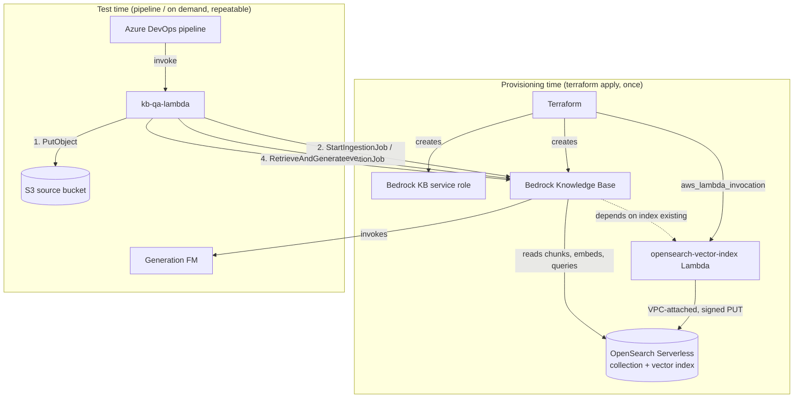
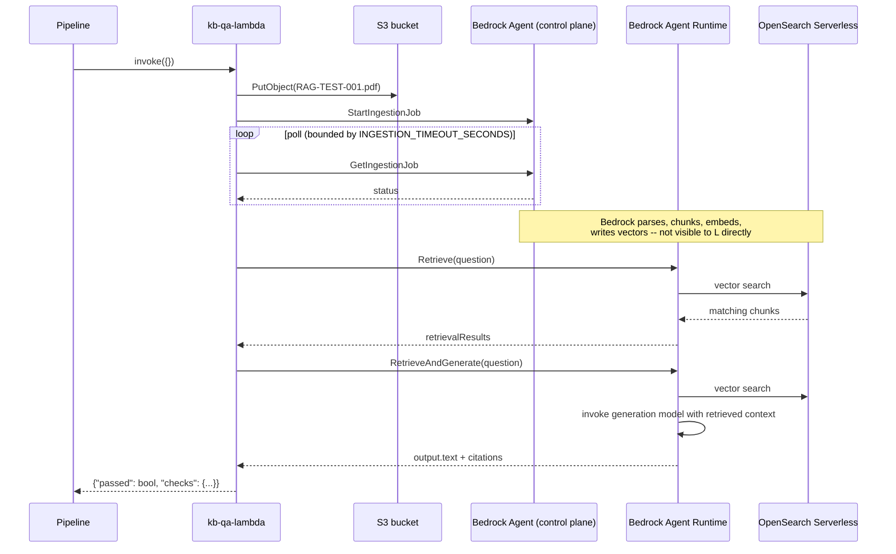

# QA Architecture — Bedrock Knowledge Base RAG Pipeline

This is the **design** document: what the QA subsystem is made of, why
it's shaped this way, and how its pieces relate to the rest of the
stack. For the **procedure** (what to run, what to expect, how to
diagnose a failure), see `QA_TEST_PLAN.md`.

## 1. Scope

Validates that a document landing in S3 is actually retrievable and
groundable through the deployed Knowledge Base — the ingestion path and
the query path, end to end, using a synthetic fact no foundation model
already knows.

**Out of scope** (deliberately, not by oversight): load/performance
testing, multi-document corpus behavior, metadata filtering, testing
the Story 9 application role's own restrictions (that needs its own
plan once that role exists), and the ElastiCache/Valkey criteria from
an earlier message that don't belong to this epic.

## 2. Two components, two lifecycles — not one

| | `opensearch-vector-index` Lambda | `kb-qa-lambda` |
|---|---|---|
| **Runs** | Once, at `terraform apply` time | Repeatedly, on demand / per pipeline run |
| **Triggered by** | `aws_lambda_invocation` (Terraform) | Manual/pipeline `aws lambda invoke` |
| **Job** | Provision the vector index | Validate the deployed pipeline |
| **Touches OpenSearch directly?** | Yes — signed data-plane PUT | No — only through Bedrock's APIs |
| **VPC-attached?** | Yes (reaches a private collection) | No (doesn't need to be — see §4) |

They look similar (both are small boto3 Lambdas) but sit at different
points in the resource dependency graph and must not be merged: the
index has to exist *before* the Knowledge Base resource can be created,
which is a hard Bedrock precondition, not a preference. Collapsing them
into one Lambda would mean re-running index creation on every test
invocation for no benefit, or — worse — making the KB resource depend
on something that also does test assertions, entangling provisioning
correctness with test-run correctness.

## 3. Component diagram

## 4. Network path — why only one Lambda needs the VPC

A finding from building this out, worth stating explicitly since it's
not obvious: **Bedrock itself never goes through our VPC endpoint.**
Its private-network access to the OpenSearch Serverless collection is
AWS-internal service-to-service (`SourceServices: bedrock.amazonaws.com`
in the collection's network policy), not a customer-side VPC endpoint
call. That's why `kb-qa-lambda` — which only ever talks to *Bedrock's*
public APIs (`Retrieve`, `RetrieveAndGenerate`, `StartIngestionJob`),
never to OpenSearch directly — doesn't need VPC attachment at all,
regardless of how private the collection's network policy is.

The **only** thing in this stack that ever makes a direct data-plane
call to OpenSearch Serverless is `opensearch-vector-index`, which is
exactly why it's the one Lambda that needs `vpc_subnet_ids` set.

## 5. IAM / trust-boundary map

Four distinct identities touch this stack. Conflating any two of them
was the thing flagged earlier as the real risk (see Step 2's
deployer-vs-Bedrock split) — this table is the full picture now that
more pieces exist.

| Identity | Trusted by | Can do | Cannot do | In OSS data access policy? |
|---|---|---|---|---|
| **Terraform deployer** (`deployer-access/`) | you / CI OIDC | Create/modify all resources below | Assume the KB role directly (only `PassRole` to Bedrock) | No — control-plane only |
| **Bedrock KB service role** (`modules/bedrock-knowledge-base`) | `bedrock.amazonaws.com` only | S3 read (one bucket), `InvokeModel` (Titan V2 only), OSS `APIAccessAll` (one collection), KMS decrypt | Create/modify infrastructure | **Yes** |
| **Index-creation Lambda role** (`modules/opensearch-vector-index`) | `lambda.amazonaws.com` | OSS `APIAccessAll` (one collection), manage its own ENI | Touch S3, Bedrock, or KMS | **Yes** |
| **QA Lambda role** (`modules/kb-qa-lambda`) | `lambda.amazonaws.com` | S3 write (test prefix only), `StartIngestionJob`, `Retrieve`/`RetrieveAndGenerate`, `InvokeModel` (generation model only) | Touch OpenSearch directly, touch KMS | No — reaches OSS only via Bedrock |
| *(future)* **Application role** (Story 9, not yet built) | your app's compute | `Retrieve`/`RetrieveAndGenerate` only | S3, OSS, `StartIngestionJob` — explicitly, per Story 9's acceptance criteria | No |

Two principals need the OSS data access policy entry; two don't. This
policy (Story 3, not yet built) is the piece that turns this table from
a plan into something enforced — until it exists, the KB role and the
index-creation Lambda role have IAM permission but no actual OSS-side
authorization, which surfaces as a 403 that IAM alone won't explain.

## 6. Sequence: one QA run

The gap in the middle (chunking/embedding/writing) is intentional in
this diagram — `kb-qa-lambda` never observes it directly, only its
effects (ingestion status, then retrieval results). That's why
`QA_TEST_PLAN.md` Step 6 (raw `Retrieve`, bypassing generation) exists
as a separate manual check: it's the only way to inspect what actually
landed in the index without also involving the generation model.

## 7. Failure-isolation design principle

`kb-qa-lambda`'s handler returns a `checks` dict with one boolean per
stage (`s3_upload`, `ingestion_status`, `retrieve_matched_expected_fact`,
`generated_contains_expected_fact`, ...) rather than a single pass/fail
— this is a deliberate design choice, not incidental logging. It's what
lets `QA_TEST_PLAN.md` map each possible failure straight to one of four
IAM roles or one of two Lambda modules, instead of "the test failed,
start debugging from S3." The CLI steps in the test plan
(Steps 4-7) are the same isolation principle applied manually, for when
you need to bypass the Lambda's own IAM role and rule out "is this the
QA role or something downstream."

## 8. Known gaps / unverified points (carried forward, not resolved here)

- **OSS data access policy doesn't exist yet** (§5's "Yes" column is
  aspirational until Story 3 is built) — both the KB role and the
  index-creation Lambda role will 403 against a real collection until
  it does.
- **`bedrock-agent`/`bedrock-agent-runtime` field names** in
  `kb-qa-lambda/src/handler.py` are from training knowledge, not a
  live-checked API reference (flagged in that module's README).
- **`aws_lambda_invocation`'s `lifecycle_scope` argument** is likewise
  unverified against a live provider schema (flagged in
  `opensearch-vector-index/README.md`).
- **KMS is not directly exercised by any QA assertion** — a KMS
  permission error would surface as an `ingestion_status != COMPLETE`
  failure (Test Plan Step 5), correctly pointing at the KB role, but
  nothing in this architecture asserts "KMS encryption is actually
  happening" as its own check.
